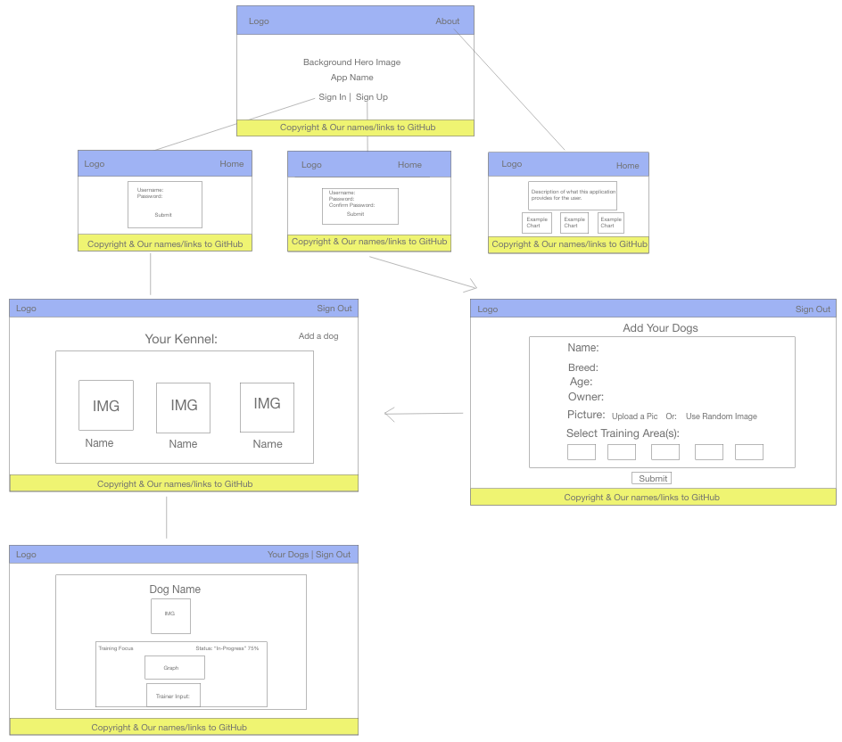
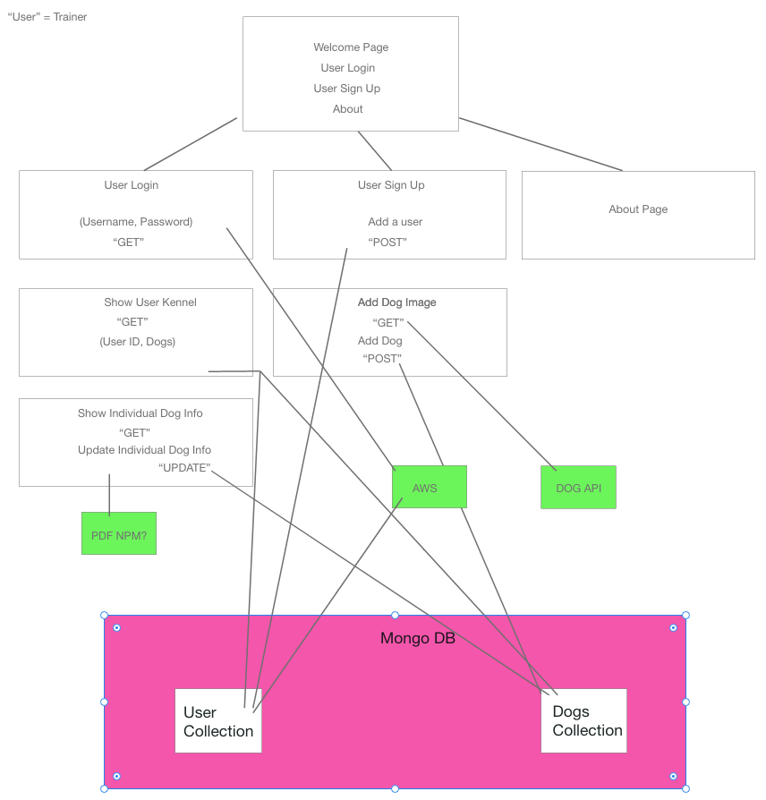

# Camp K-9

## Project 3 

## Contributors & Roles:
 - Dakota Melcher (Back End)
 - Maria Betancourt (Front End)
 - Giancarlo Brida (Front End)
 - Rob Kellen (Back End)

## Application Name: Camp K-9

## Overview:
This application allows a dog trainer to track the progress of various training focuses for each individual dog in their training regimen.  By maintaining the progress of each dog’s training focus the trainer is able to show tangible data to the dog owner after each training session.

## User Story:
I would like to be able to log relevant information in the training of a dog. I want to be able to input the skill and the measurements for that skill and track these measurements over time. After I input the data I would like to be able to easily view the pets progress over time with easily understandable charts/graphs. I would like to have a list of all dogs that I am currently training and be able to select them each individually. Then I would like to be able to export a PDF file that I can send to the dogs owner to show them the progress made.
Schedule & Project Management Board:

## Technologies/Libraries:
 - Mongo Database
 - Mongoose ORM
 - Node/Express Server
 - React Front-End
 - Bootstrap
 - Chart JS
 - Axios
 - AWS Amplify
 - Dogs.ceo API
 - PDF Kit NPM ???

## UI/UX Layout:

## Workflow:

## Expectations:
 - App must have utility
 - Must have market or real-world research that evidences your idea has REAL value to people
 - Do research on other web/mobile apps in your domain
 - Utilize a Project Management System

## Requirements:
 - Must use ReactJS
 - Must use Node and Express web server
 - Must be backed by MongoDB or MySQL with Mongoose or Sequelize ORM
 - Must have both GET and POST routes for retrieving new data
 - Must be deployed using Heroku (with data)
 - Must utilize as least two libraries, packages, or technologies that we haven’t discussed
 - Must allow for or involve the authentication of users in some way
 - Must have a polished frontend/UI
 - Must have a folder structure that meets the MVC paradigm
 - Must meet good quality coding standards (indentation, scoping, naming, comments)
 - Must not expose sensitive API key information on the server

